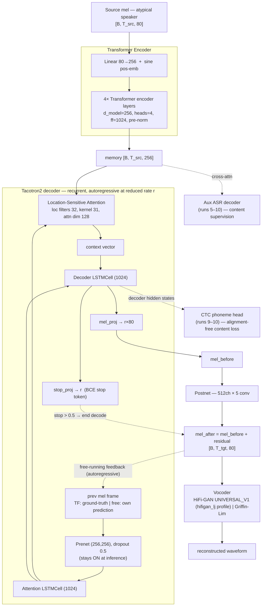
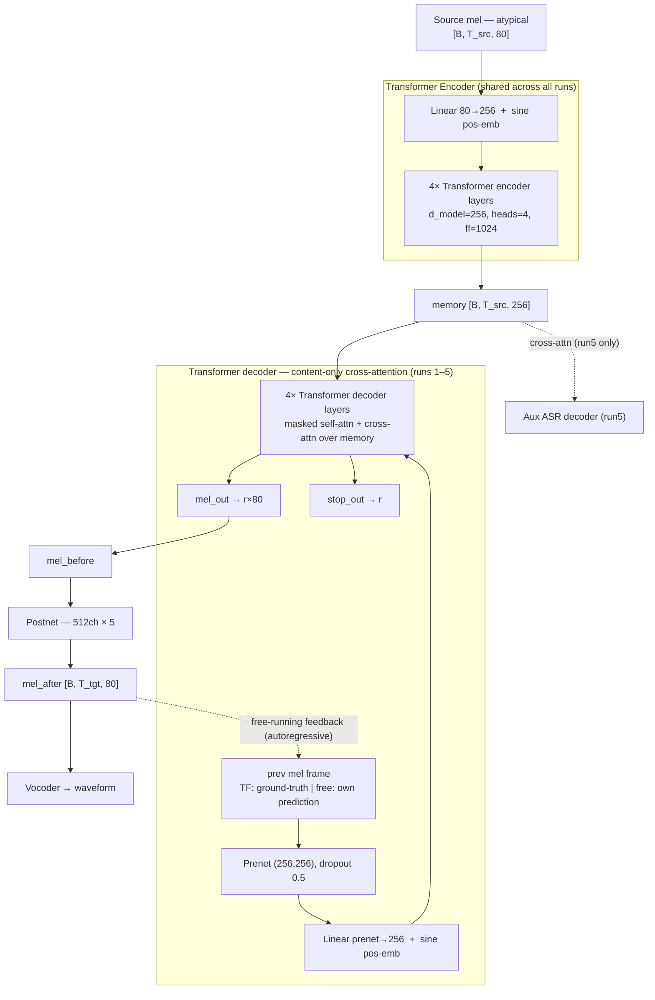
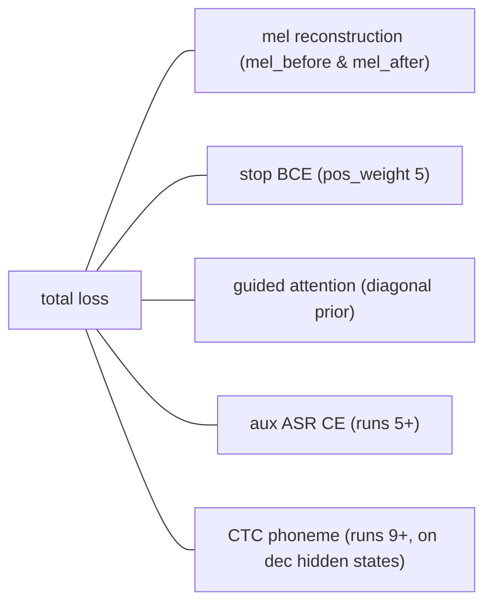
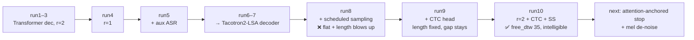
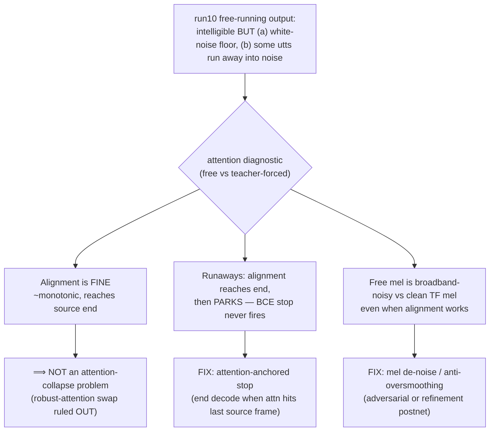

# VTN — Voice Transformer Network for Dysarthric Voice Reconstruction

Direct **mel → mel** voice conversion: encode an *atypical* (dysarthric) source mel, decode a
*clean target* mel (StyleTTS2-synthesized ground truth), vocode to audio. The research problem is
**free-running (autoregressive inference) quality**: teacher-forced reconstruction is crystal
clear, but feeding the decoder its own predictions degrades the output. The cascade ASR→TTS system
is the *comparison baseline*; the VTN is the contribution.

> Repo: `sap-voice-reconstruction`, branch `vtn-tacotron2-lsa-decoder` (nuvan). Trained on the SAP
> TRAIN split, validated on VAL; 2× A4500 DDP via SLURM.

---

## Architecture (runs 6–10: Tacotron2-LSA decoder — current)

### Earlier architecture (runs 1–5: Transformer decoder)

Same encoder, but the decoder was a content-only cross-attention Transformer instead of the
recurrent LSA stack:

**Why it was abandoned at run6:** content-only cross-attention has no location/monotonicity bias,
so in free-running it *parks* on a fixed source region and the output collapses. That motivated the
switch to the **location-sensitive (LSA) recurrent decoder** (the diagram above), whose attention
convolves the cumulative alignment to bias monotonic advancement. Lineage within this variant:
runs 1–4 had **no** aux ASR head (run5 added it); reduction factor was **r=2** (runs 1–3) then
**r=1** (runs 4–5).

### Training losses

- **Scheduled sampling (runs 8+):** `ss_prob` ramps up over training (warmup → linear ramp), so
  the decoder is increasingly fed its *own* predictions during teacher-forced training — meant to
  reduce the train/inference (exposure-bias) mismatch.
- **Reduction factor r:** decoder emits `r` mel frames per step (r=2 → shorter autoregressive
  rollout; r=1 → frame-by-frame).

---

## Experiments (run1 → run10)

`free_dtw` = length-normalized DTW mel-L1 between **free-running** output and target (lower =
closer). `tf_dtw` is the teacher-forced equivalent (the "clear" ceiling, ~16–21). The free-running
metric was only added at run8, when exposure bias became the focus.

| Run | Decoder | r | Aux ASR | SS | CTC | final free_dtw | Outcome |
|-----|---------|---|:---:|:---:|:---:|:---:|---------|
| **run1** | Transformer | 2 | – | – | – | (not logged) | initial mel→mel VC baseline |
| **run2** | Transformer | 2 | – | – | – | (n/l) | repeat / stabilize |
| **run3** | Transformer | 2 | – | – | – | (n/l) | batch 6 |
| **run4** | Transformer | 1 | – | – | – | (n/l) | frame-by-frame (r=1) |
| **run5** | Transformer | 1 | ✓ | – | – | (n/l) | + auxiliary ASR head (content supervision) |
| **run6** | **Tacotron2-LSA** | 1 | ✓ | – | – | (n/l) | switch to recurrent location-sensitive decoder |
| **run7** | Tacotron2-LSA | 1 | ✓ | – | – | (n/l) | listening baseline (`infer_run7_best`) |
| **run8** | Tacotron2-LSA | 1 | ✓ | ✓ | – | **44.8** | scheduled sampling → **FAILED**: flat free_dtw + destabilized length |
| **run9** | Tacotron2-LSA | 1 | ✓ | ✓ | ✓ | **41.2** | + CTC head → rescued length (hit_max 0), gap **not** closed |
| **run10** | Tacotron2-LSA | **2** | ✓ | ✓ | ✓ | **35.3** | r=2 + late SS ramp → **best so far; intelligible via HiFi-GAN** |

---

## run10 diagnosis (attention + mel dump, step 40000)

Rendered the standard set through HiFi-GAN UNIVERSAL_V1; **words are recoverable** — the best
result yet. Two defects remain, and the attention/mel diagnostic pinned each to a mechanism:

**Next steps (priority):**
1. **Attention-anchored stop** — inference-only change to `Tacotron2Decoder.infer()`; kills the
   runaway white-noise. Quick win.
2. **Mel noise-floor** — the real research lever: adversarial/anti-oversmoothing refinement of the
   free-running mels (the broadband hiss the vocoder faithfully renders).
3. Deprioritized: robust/monotonic attention (DCA/forward) and non-AR decoding — the diagnostic
   shows alignment is *not* the bottleneck.
